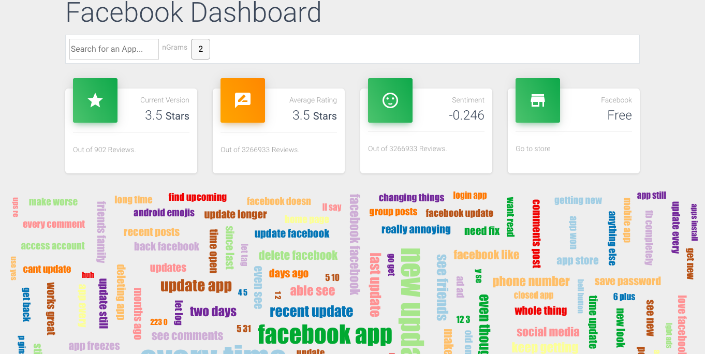

# App Review Dashboard
A frontend to show a tag cloud of ngrams based on app review. Also shows sentiment analysis. Made with svelte and d3.



```bash
cd app-review-dashboard
npm install
```

then start [Rollup](https://rollupjs.org):

```bash
npm run dev
```

Navigate to [localhost:5000](http://localhost:5000). You should see your app running. Edit a component file in `src`, save it, and reload the page to see your changes.


## Deploying to the web

```bash
npm run deploy
```
